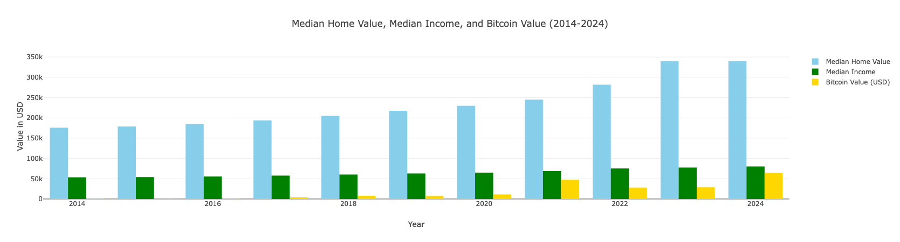
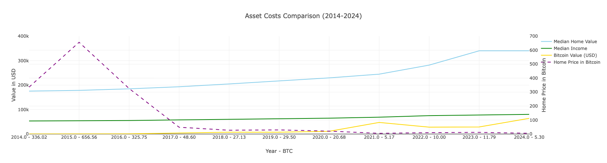
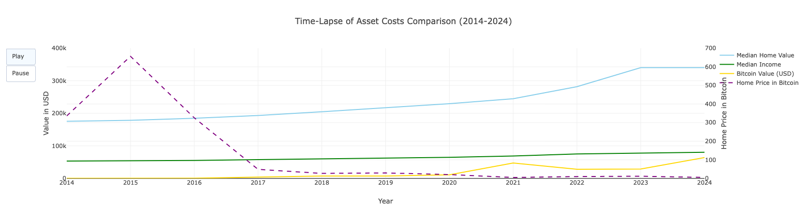

# AssetCostsCompared

## Overview

**AssetCostsCompared** is a data visualization project that examines the median cost of U.S. homes from 2014 to 2024, comparing prices measured in U.S. Dollars to Bitcoin (BTC). The project highlights the deflationary nature of free-market assets like Bitcoin against the inflationary impact of fiat currencies like the U.S. Dollar.

The analysis is presented through three interactive graphs hosted on a dashboard:
1. **Bar Graph** - Compares median home value, median income, and Bitcoin value across the years.
2. **Line Graph** - Displays trends for home prices, income, Bitcoin value, and home price in Bitcoin over time.
3. **Time-lapse Graph** - Animates the trends year by year for an engaging visualization.

---

## Visualizations

Below are examples of the graphs you will see when running the project:

### Bar Graph


### Line Graph


### Time-lapse Graph


---

## Background

Initially, the project relied on live API data from sources such as Zillow, the U.S. Census Bureau, and CoinMarketCap. However, this approach proved unreliable due to fluctuating API responses and limitations. To address this, all fetched data was committed to a local CSV file, `asset_costs_df.csv`, ensuring consistency and repeatability.

The project also evolved from a simple sequential display of graphs using Matplotlib to a fully interactive **Dash dashboard**. This change was driven by user experience considerations, as requiring users to close each graph manually proved cumbersome. The dashboard provides a seamless and engaging way to explore the data.

---

## Instructions

Follow these steps to set up and run the project:

### 1. Prerequisites
Ensure you have the following installed on your system:
- Python 3.7 or later
- Pip (Python package manager)

### 2. Clone the Repository
Clone the project repository to your local machine:
```bash
git clone <repository-url>
cd AssetCostsCompared

### 3. Set Up the Environment
Create and activate a virtual environment:

In bash or terminal:

python3 -m venv venv
source venv/bin/activate  # On Windows: venv\Scripts\activate

# Install the required packages:
pip install -r requirements.txt

### 4. Run the Application
Run the Python script to launch the dashboard:

In bash or Terminal:

python AssetCostsCompared.py


### 5. Access the Dashboard
The dashboard will automatically open in your default web browser. You can also manually access it at http://127.0.0.1:8050.

### Notes
The project uses asset_costs_df.csv as its data source. Make sure this file exists in the project directory.
For any issues or questions, feel free to create an issue on the repository or reach out directly.

Enjoy exploring the data with AssetCostsCompared!
